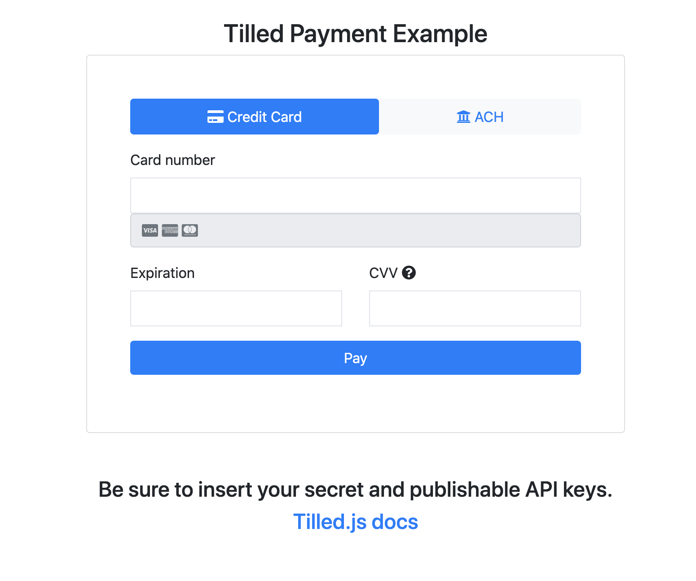

# Dependencies
- [Node.js](https://nodejs.org)
# Get started

- Clone the project
- Install dependencies:
  ```
  $ npm install
  ```

# Create a sandbox account and add your configuration values

- [Register a sandbox account](https://sandbox-app.tilled.com/auth/register)
- [Create secret and publishable API keys](https://sandbox-app.tilled.com/api-keys)
  - Add your secret API key to the `tilledSecretApiKey` variable in `app.js`
  - Add your publishable API Key to the `pk_PUBLISHABLE_KEY` variable in `index.html`
- [View your list of connected accounts](https://sandbox-app.tilled.com/connected-accounts) and either use the auto-created `Shovel Shop (demo)` account or create your own connected account. *Note: Prefix the name of the account with an asterisk (ex. '\*The Surf Shop') to bypass needing to submit an onboarding form*.
  - Add an *active* connected Account ID to the `account_id` variable in `index.html`
- Run the sample server:

   ```
   $ node app.js
   ```

# Process your first payment


- Navigate to [http://localhost:5000](http://localhost:5000) in your browser, enter `4037111111000000` as the test card number with a valid expiration date and `123` as the CVV Code and click Pay
- Optional: Look in the browser's developer console to see payment intent creation logs
- Go [here](https://sandbox-app.tilled.com/payments) to see your payment

# What's Next?
[API Docs](api.tilled.com/docs)

You can try out attaching payment methods to customers, adding metadata, including platform fees on payment intents and much, much more via the Tilled API.
